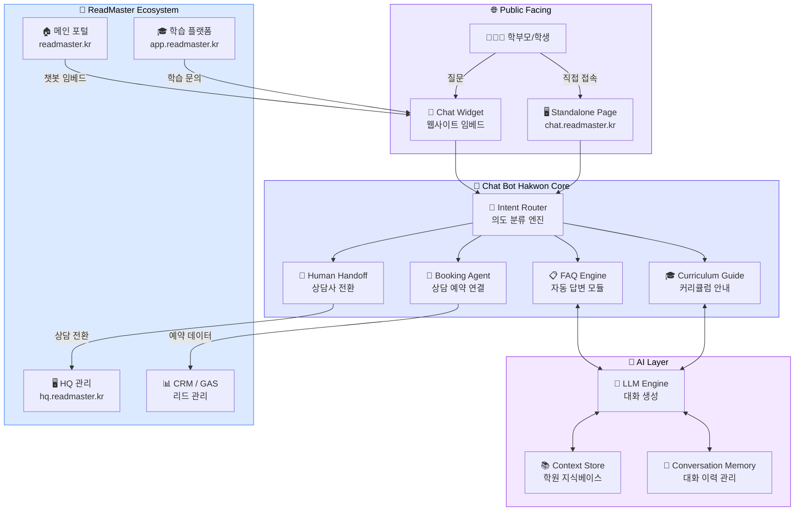

<div align="center">

# 🤖 Chat Bot Hakwon

### AI 상담 챗봇 — ReadMaster Franchise Ecosystem

**24시간 학부모 문의 응대 · 커리큘럼 안내 · FAQ 자동 답변 · 상담 예약 연결**

[](https://chat-bot-hakwon.vercel.app)
[](https://chat-bot-hakwon.vercel.app)
[](https://chat-bot-hakwon.vercel.app)
[](#-architecture)
[](https://readmaster-franchise.vercel.app)

<br/>

[](https://chat-bot-hakwon.vercel.app)
[](#)
[](#-readmaster-ecosystem-position)
[](#-license)

---

*"학부모가 새벽 2시에 궁금한 것도, AI가 즉시 답합니다."*

[라이브 데모](https://chat-bot-hakwon.vercel.app) · [에코시스템 허브](https://readmaster-franchise.vercel.app) · [이슈 리포트](https://github.com/Reasonofmoon/chat-bot-hakwon/issues)

</div>

---

## 📖 Philosophy

> **"상담 대기 시간 = 이탈률"** — 학원 업계에서 학부모 문의의 70%는 영업시간 외에 발생합니다.
> 반복적인 FAQ 응대에 원장님 시간을 쓰는 대신, AI가 24시간 즉각 응대하고
> 진짜 상담이 필요한 케이스만 원장님께 연결합니다.

### 기존 방식 vs Chat Bot Hakwon

| | 기존 학원 상담 | Chat Bot Hakwon |
|---|---|---|
| **응답 시간** | 영업시간 내 평균 4~8시간 | ⚡ **즉시 응답 (24/7)** |
| **커리큘럼 안내** | 전화/방문 후 설명 | 🎓 대화형 맞춤 안내 |
| **FAQ 처리** | 원장/상담사가 반복 답변 | 🤖 AI 자동 답변 |
| **상담 예약** | 전화 → 수기 기록 | 📅 챗봇 내 즉시 예약 |
| **야간/주말 문의** | ❌ 부재중 → 이탈 | ✅ 항시 응대 → 리드 확보 |
| **다국어 지원** | 한국어만 | 🌍 AI 기반 다국어 대응 |
| **데이터 수집** | 없음 | 📊 대화 로그 → CRM 연동 |

---

## 🏗️ Architecture



---

## ✨ Layer-by-Layer Features

### 🔀 Layer 1 — Intent Router (의도 분류)

학부모의 자연어 질문을 분석하여 최적의 처리 경로로 라우팅합니다.

| Feature | Description |
|---|---|
| **자연어 의도 분류** | "수업료가 얼마인가요?" → 💰 Fee FAQ 라우팅 |
| **멀티턴 컨텍스트** | 이전 대화 맥락을 유지하며 정확한 분류 |
| **폴백 핸들링** | 분류 불가 시 상담사 연결로 자연스러운 전환 |

> 💡 **Wow Moment** — *"영어 읽기 수준이 어느 정도인지 모르겠어요"라고 말하면,
> 자동으로 무료 레벨테스트 링크(readmaster.kr/level-test)를 안내합니다.*

### 📋 Layer 2 — FAQ Engine (자동 답변)

학원 운영에서 가장 빈번한 질문들을 지식베이스 기반으로 즉시 답변합니다.

| Feature | Description |
|---|---|
| **커리큘럼 FAQ** | 프로그램별 대상 연령, 수업 방식, 교재 정보 |
| **운영 FAQ** | 수업 시간, 수강료, 위치, 주차 안내 |
| **이벤트 FAQ** | 설명회 일정, 체험 수업, 할인 프로모션 |
| **동적 업데이트** | 지식베이스 수정 시 실시간 반영 |

> 💡 **Wow Moment** — *계절학기 시작 전, 자동으로 "여름 특강 프로그램"을 상단에 노출하여
> 학부모가 물어보기도 전에 정보를 제공합니다.*

### 🎓 Layer 3 — Curriculum Guide (커리큘럼 안내)

대화형으로 자녀에게 맞는 커리큘럼을 추천하는 인터랙티브 가이드입니다.

| Feature | Description |
|---|---|
| **연령별 추천** | 자녀 나이/학년 입력 → 적합 프로그램 추천 |
| **레벨별 안내** | 영어 수준에 따른 단계별 커리큘럼 설명 |
| **비교 안내** | "파닉스 vs 리딩" 등 프로그램 간 비교 |
| **레벨테스트 연결** | 추천 후 바로 레벨테스트 응시 유도 |

> 💡 **Wow Moment** — *"초등 2학년인데 영어를 처음 시작해요"라는 한 마디로,
> Phonics → Bridge Reading → Reading Master 전체 로드맵을 시각적으로 보여줍니다.*

### 📅 Layer 4 — Booking & CRM (예약 연동)

상담/설명회 예약을 챗봇 대화 내에서 완결하고, CRM에 자동 등록합니다.

| Feature | Description |
|---|---|
| **인라인 예약** | 대화 중 바로 상담 일시 선택 |
| **GAS 연동** | Google Apps Script 백엔드로 예약 데이터 전송 |
| **CRM 자동 등록** | 리드 정보 자동 수집 → HQ 대시보드 반영 |
| **알림 발송** | 예약 확인 메시지 자동 발송 |

> 💡 **Wow Moment** — *예약 완료 시 학부모에게 확인 메시지 + 원장님에게 새 리드 알림이 동시에 발송됩니다.*

---

## 🚀 Getting Started

### 🟢 Starter — 로컬 개발 환경

```bash
# 1. 레포지토리 클론
git clone https://github.com/Reasonofmoon/chat-bot-hakwon.git
cd chat-bot-hakwon

# 2. 의존성 설치
npm install

# 3. 환경 변수 설정
cp .env.example .env.local
# .env.local에 API 키 설정 (절대 커밋하지 마세요!)

# 4. 개발 서버 실행
npm run dev
```

→ `http://localhost:3000`에서 챗봇 확인

### 🔵 Professional — Vercel 배포

```bash
# Vercel CLI로 배포
npx vercel --prod

# 또는 GitHub 연동 후 자동 배포
# Settings → Environment Variables에 API 키 설정
```

→ `chat-bot-hakwon.vercel.app`에서 라이브 확인

### 🟣 Enterprise — 에코시스템 통합

```html
<!-- ReadMaster 메인 포털에 위젯 임베드 -->
<script src="https://chat.readmaster.kr/widget.js"></script>
<script>
  ReadMasterChat.init({
    position: 'bottom-right',
    theme: 'readmaster',
    locale: 'ko',
    academy: 'your-branch-id'
  });
</script>
```

→ 모든 ReadMaster 사이트에 통합 채팅 위젯 활성화

---

## 🎨 Customization Priority

| 우선순위 | 항목 | 설명 | 난이도 |
|:---:|---|---|:---:|
| 🔴 P0 | **지식베이스 구성** | 학원별 FAQ, 커리큘럼 데이터 입력 | ⭐ |
| 🔴 P0 | **API 키 설정** | LLM 엔진 연결을 위한 인증 설정 | ⭐ |
| 🟠 P1 | **브랜딩 커스텀** | 로고, 색상, 인사말 메시지 변경 | ⭐⭐ |
| 🟠 P1 | **CRM 연동** | GAS 백엔드 엔드포인트 연결 | ⭐⭐ |
| 🟡 P2 | **위젯 스타일링** | 임베드 위젯 위치, 크기, 애니메이션 | ⭐⭐ |
| 🟡 P2 | **응답 톤 조정** | AI 답변 스타일 (격식체/친근체) 설정 | ⭐⭐ |
| 🟢 P3 | **다국어 추가** | 영어, 중국어 등 추가 언어 지원 | ⭐⭐⭐ |
| 🟢 P3 | **분석 대시보드** | 대화 통계, 전환율, 인기 질문 분석 | ⭐⭐⭐ |

---

## 📁 Project Structure

```
chat-bot-hakwon/
├── .gitignore              # Git 제외 파일 설정
├── ecosystem.json          # ReadMaster 에코시스템 통합 설정
├── README.md               # 프로젝트 문서
├── public/                 # 정적 에셋
│   └── widget.js           # 임베드 위젯 스크립트
├── src/
│   ├── app/                # 앱 라우팅 (Next.js App Router)
│   ├── components/
│   │   ├── chat/           # 채팅 UI 컴포넌트
│   │   ├── widget/         # 임베드 위젯 컴포넌트
│   │   └── ui/             # 공통 UI 컴포넌트
│   ├── lib/
│   │   ├── ai/             # LLM 엔진 연결
│   │   ├── faq/            # FAQ 지식베이스 엔진
│   │   ├── booking/        # 상담 예약 로직
│   │   └── crm/            # CRM/GAS 연동
│   ├── data/
│   │   ├── knowledge/      # 학원 지식베이스 (커리큘럼, FAQ)
│   │   └── prompts/        # AI 프롬프트 템플릿
│   └── types/              # TypeScript 타입 정의
├── package.json
└── vercel.json             # Vercel 배포 설정
```

---

## 📊 Numbers & Stats

| Metric | Target |
|---|---|
| **응답 속도** | < 2초 (평균) |
| **FAQ 자동 해결률** | > 80% |
| **상담 예약 전환율** | > 15% |
| **야간 문의 응대율** | 100% (24/7) |
| **위젯 로드 시간** | < 500ms |
| **지원 언어** | 한국어 (기본) + 다국어 확장 |
| **에코시스템 연동** | 8개 레포지토리 통합 |

---

## 📋 Requirements

| Category | Requirement | Version |
|---|---|---|
| **Runtime** | Node.js | >= 18.0 |
| **Package Manager** | npm / yarn / pnpm | Latest |
| **AI Engine** | OpenAI API 또는 호환 LLM | GPT-4+ 권장 |
| **Backend** | Google Apps Script (CRM 연동) | Latest |
| **Deploy** | Vercel | Latest |
| **Browser** | Chrome, Safari, Firefox, Edge | 최신 2개 버전 |

---

## 🔗 ReadMaster Ecosystem Position

Chat Bot Hakwon은 **ReadMaster 프랜차이즈 에코시스템**의 **고객 접점(Engagement) 레이어**에 위치합니다.

```
┌─────────────────────────────────────────────────────────┐
│  PUBLIC FACING — 고객 접점                                │
│  🏠 메인 포털    📢 마케팅 퍼널    🤖 AI 상담 챗봇 ◀ HERE │
├─────────────────────────────────────────────────────────┤
│  SERVICE LAYER — 교육 서비스                              │
│  🎓 학습 플랫폼   📊 학부모 리포트   🧠 AI 독서 엔진       │
│  🏥 OET Korea                                           │
├─────────────────────────────────────────────────────────┤
│  MANAGEMENT — 운영 백엔드                                 │
│  🖥️ HQ 관리 (9-에이전트 오케스트레이션)                    │
└─────────────────────────────────────────────────────────┘
```

| 연동 대상 | 연동 방식 | 용도 |
|---|---|---|
| **메인 포털** (readmaster.kr) | Widget 임베드 | 메인 사이트 채팅 지원 |
| **마케팅 퍼널** (go.readmaster.kr) | Widget 임베드 | 설명회/상담 전환 |
| **학습 플랫폼** (app.readmaster.kr) | API 연동 | 학습 관련 문의 처리 |
| **HQ 관리** (hq.readmaster.kr) | Webhook | 상담사 전환, 리드 알림 |
| **CRM / GAS** | REST API | 예약 데이터, 리드 수집 |

---

## 🌍 i18n

| Language | Status | Coverage |
|---|---|---|
| 🇰🇷 한국어 | ✅ 기본 | 100% |
| 🇺🇸 English | 🔜 계획 | AI 기반 자동 대응 |
| 🇨🇳 中文 | 🔜 계획 | AI 기반 자동 대응 |
| 🇯🇵 日本語 | 🔜 계획 | AI 기반 자동 대응 |

> LLM 기반이므로 별도 번역 파일 없이 **프롬프트 레벨에서 다국어 전환**이 가능합니다.

---

## 🤝 Contributing

ReadMaster 에코시스템에 기여해 주셔서 감사합니다!

```bash
# 1. Fork & Clone
git clone https://github.com/YOUR_USERNAME/chat-bot-hakwon.git

# 2. 브랜치 생성
git checkout -b feature/your-feature

# 3. 변경 사항 커밋
git commit -m "feat: 새로운 기능 추가"

# 4. PR 생성
git push origin feature/your-feature
```

**커밋 컨벤션**: `feat:` / `fix:` / `docs:` / `refactor:` / `chore:`

---

## 📄 License

MIT License — 자유롭게 사용하되 출처를 밝혀주세요.

---

<div align="center">

**ReadMaster Franchise Ecosystem v2.0.0**

🏠 [메인 포털](https://readmaster-franchise.vercel.app) · 🎓 [학습 플랫폼](https://read-master-academy.vercel.app) · 🤖 [AI 상담](https://chat-bot-hakwon.vercel.app) · 🖥️ [HQ 관리](https://readmaster-hq.vercel.app)

*학원 프랜차이즈의 미래를 AI로 설계합니다.*

</div>
